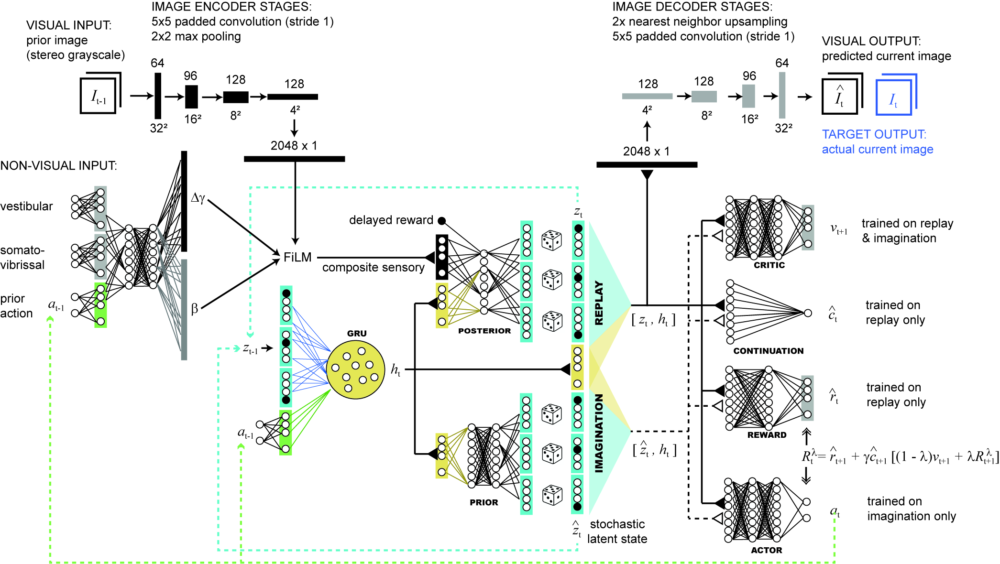
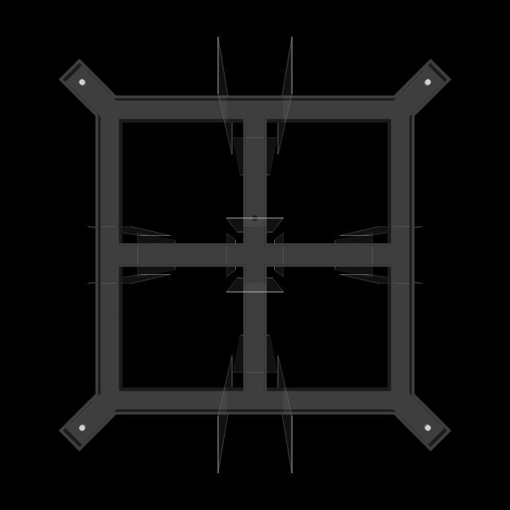
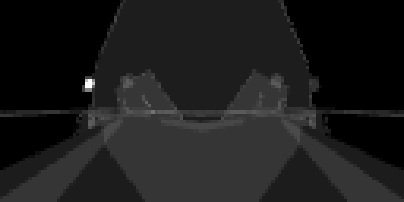

# Dreamer: PIVC, PI, and VC acquisition

Training source and simulation resources for the original **PIVC256, PI256, and VC256** elevated-track models, without an option-vector input to the posterior. All three start from random initialization, use 256-step training sequences, and imagine 15 steps. PIVC256_64i, PIVC64, transfer-learning runs, and later option/curriculum models are outside this release.

The repository contains the complete modified Dreamer source, the MuJoCo scene, task and sensory code, portable launchers, locked dependencies, and reference configurations and criterion records. No separate Memory Maze checkout, MATLAB file, texture download, or local Shapely folder is needed for this task.

## Project links and accompanying paper

- [Official DreamerV3 website](https://danijar.com/project/dreamerv3/): the original Dreamer project, paper, and implementation.
- [Grgurich et al. — accompanying paper (PDF)](docs/papers/Grgurich_et_al_final.pdf).

## Models and stored endpoints

| Model | Training condition | Recorded criterion step | First reward step | Steps since first reward |
| --- | --- | ---: | ---: | ---: |
| PIVC256 | Fixed task frame; bright east cue when reward is available | 978,599 | 87,830 | 890,769 |
| PI256 | Fixed task frame; all four screens remain dim | 3,673,270 | 831,693 | 2,841,577 |
| VC256 | Goal frame independently rotates between trials; visual goal cue | 1,846,600 | 205,375 | 1,641,225 |

PIVC combines path integration and visual cues; PI is the always-dim condition; VC uses the rotating goal frame. These names describe task conditions. PI still receives stereo images, and VC still receives motion and proximity signals: neither label means that those sensory channels have been removed.

Training stops after **one completed session with 32 rewards, no fall, exactly 16 proximal and 16 distal first choices, and at least 12 correct first choices in each group**. All three recorded qualifying sessions happened to achieve 16/16 in both groups. The criterion is an acquisition stopping rule on training sessions, not a held-out generalization test. Global steps count accepted non-reset transitions across all 16 workers.

The exact checkpoint identities, SHA-256 hashes, byte counts, and original local locations are in [reference/manifest.json](reference/manifest.json). Each `reference/<model>/` folder includes the resolved `config.yaml`, `criterion_reached.json`, first-reward record, and session evidence. These are historical records; their absolute paths are provenance, not installation requirements.

**Checkpoint weights and replay are not committed to Git.** Each reference checkpoint is approximately 527 MB. They are not needed to train from scratch. The existing weights remain at the locations in the manifest. `scripts/export_checkpoints.py` can create verified archives from an existing original workspace for separate distribution. The archives contain checkpoint members and configuration/criterion records, not the external replay chunks required for replay-preserving continuation. This source release does not provide a remote checkpoint download.

Re-running this code targets the same criterion and configuration, not bitwise-identical weights or a guaranteed identical stopping step. GPU arithmetic, process scheduling, environment resets on resume, and stochastic training affect trajectories. Original runs included an 8,192-step validation segment before continuation; that workflow is shown below.

## Install

The recorded runtime was Ubuntu 24.04 / Python 3.12 in WSL2, CUDA JAX 0.6.2, and an NVIDIA RTX 5090 with 32 GB VRAM. Training used bfloat16, 16 environment workers, and substantial host memory (96 GB assigned to WSL). A Linux NVIDIA driver with CUDA support and EGL rendering must already work. Native Windows training is not the supported workflow.

Clone or copy the repository onto the **Linux filesystem**, then run:

```bash
bash scripts/setup-linux.sh
source .venv/bin/activate
bash scripts/check.sh
```

Setup installs Ubuntu rendering/build packages and the pinned Python environment from `requirements-resolved.txt`. The lock preserves the original environment, with `shapely==2.1.2` added explicitly because the original workspace loaded it from a separate dependency directory. The lock includes packages used by the broader original environment; not every package is used by this task. The upstream `requirements.txt` and Dockerfile inside each vendored tree are historical upstream files; use the root setup instructions for this release.

## Train

Run one GPU training job at a time. For a small integration check (separate output directory):

```bash
bash scripts/train_elevated_pivc256.sh smoke
bash scripts/train_elevated_pi256.sh smoke
bash scripts/train_elevated_vc256.sh smoke
```

Smoke mode uses 2 workers, 512 steps, batch size 4, sequence length 64, and training ratio 8. It verifies integration, not acquisition performance.

For the original validation-then-continuation workflow, select one model, for example:

```bash
bash scripts/train_elevated_pivc256.sh train --run.steps 8192
bash scripts/train_elevated_pivc256.sh train
```

Use `train_elevated_pi256.sh` or `train_elevated_vc256.sh` for the other models. The second command resumes the same run and continues until criterion, with no fixed step cap. To train uninterrupted from scratch instead, run only the second command in a fresh output directory.

| Setting | Full-training value |
| --- | --- |
| Config presets | `elevated_track size50m` |
| Seed / workers | 0 / 16 |
| Batch / sequence length | 4 / 256 |
| Replay capacity / training ratio | 1,000,000 / 32 |
| Imagination length | 15 |
| RSSM deterministic state | 4,096 |
| Stochastic state | 32 categorical variables, 32 classes each |
| RSSM hidden width | 512 |
| Checkpoint interval | 300 seconds and clean exit |
| GPU preallocation | 80% |
| Available host RAM guard | 12 GiB |

`Ctrl+C` or SIGTERM requests a checkpoint after the current iteration. Wait for the process to exit. Re-run the same command to resume. A completed criterion run remains completed when resumed because criterion state is checkpointed. Use a new `--logdir` for a new acquisition run, for example:

```bash
bash scripts/train_elevated_pi256.sh train --logdir "$PWD/runs/pi256-repeat"
```

The launchers derive paths from their location. Extra Dreamer flags can be appended, but changes to seed, workers, batch length, task settings, or model sizes define a different experiment. Do not point experimental runs at the preserved reference checkpoints.

## How Dreamer was modified



FiLM-augmented Dreamer schematic. [View full-resolution PNG](docs/Dreamer_2S2C.png) or [download the original TIFF](docs/Dreamer_2S2C.tif).

Implementation details for interpreting the schematic: the critic evaluates the value of its supplied state (v_t for [z_t, h_t]); the implemented continuation prediction includes the discount factor, so gamma is not multiplied in again. The GRU's previous deterministic state and the prior/posterior KL losses are implicit in the drawing.

Each `variants/elevated-<model>-film/dreamerv3/` is a complete source tree derived from Danijar Hafner's DreamerV3 revision `e3f02248693a79dc8b0ebd62c93683888ddaccfe`. Keeping the three trees separate preserves their original environment wiring and settings. These models use a CNN encoder/decoder, **not the later U-Net**.

At a transition from t to t+1, the encoder receives the previous stereo image I_t and previous proximity readings, the executed action a_t, and the measured motion over that transition. The current stereo image I_(t+1) is the reconstruction target. This turns the image objective into sensory-conditioned next-frame prediction. Reset-frame image losses are masked out.

The visual CNN produces a flattened 2,048-dimensional feature vector. Sensory FiLM embeds 61 proximity values into 128 units, the two action values into 32 units, and three motion values into 32 units. Their concatenation passes through two 256-unit SiLU layers and two 2,048-unit output heads. The resulting modulation is `(1 + scale) * visual + shift`; zero-initialized heads make this an identity operation initially.

A single binary `reward_received_previous` scalar is concatenated **after FiLM**, without an embedding. It reports the preceding control transition's positive reward, not the reward on the just-completed transition. It is zero on reset and the first transition. The current reward remains the reward-head learning target.

The posterior receives the 4,096-dimensional recurrent state and the 2,049 encoder outputs (2,048 modulated visual features plus delayed reward), giving a 6,145-wide first posterior input. There is no option vector, option identity, start label, goal-frame label, map, or absolute pose input. `log/*` observations contain scoring diagnostics and are filtered out during agent construction.

The RSSM retains its separate action path into the recurrent core. Imagined rollouts use latent dynamics, reward and continuation predictions, and the actor/critic; they do not receive future measured motion, future images, or observed reward inputs. The decoder predicts the current two-channel stereo target from latent state. Reward/continuation learning, categorical latent dynamics, and imagined actor/critic learning retain the Dreamer structure.

The training loop adds graceful stopping, an available-RAM guard, exact transition acceptance at the requested endpoint/criterion, checkpointed criterion state, and verified checkpoint retention. `VerifiedCheckpoint` preserves the folder referenced by `latest` and checks expected checkpoint members before accepting a save.

## How the MuJoCo task works



Overhead diagnostic view of the actual PIVC environment at reset (configuration 0). The agent never receives this overhead view.



Left/right observations at the same reset, enlarged with nearest-neighbor scaling for readability.

`artifacts/elevated-track/scene.xml` contains the complete static track, rim, enclosure, and camera-rig geometry. Mesh vertices are embedded in the XML, so it has no external mesh or texture dependencies. `geometry.json` records geometry checks. `scripts/build_elevated_track.py` can regenerate the static scene from the coded outline using Shapely triangulation; the committed scene is the reference training asset.

The platform surface is 1 m above the floor. The outline has central and perimeter paths around four holes, corner reward discs, and a raised rim. At runtime, the environment adds 16 transparent barriers, four tilted wall displays, and an upright spherical agent with x/y/z translation and yaw. The rendering-only camera rig is replaced by cameras attached to the physical agent.

MuJoCo integrates 125 substeps of 0.002 seconds per action: a 0.25-second control interval (4 Hz). Actions in [-1, 1] command forward/reverse velocity up to 0.30 m/s and yaw velocity up to pi rad/s. Force-limited velocity servos act through the contact solver. Walls and barriers constrain movement physically; ordinary actions do not teleport the agent. Leaving the buffered support polygon ends the session as a fall with reward -20.

The two eyes render 64x64 grayscale images, stacked as two channels. Their separation is 13 mm, height is 7 cm above the platform, yaw directions are ±50 degrees, upward pitch is 15 degrees, and vertical field of view is 150 degrees. Proximity input uses 61 head-oriented MuJoCo rays, excludes the agent itself, and maps collision distances to [0, 1] over a 0.111 m range with contact at the 0.0185 m body radius. Motion is measured in the preceding body frame: forward displacement, lateral displacement, and wrapped yaw change, normalized by body radius and pi/6 respectively.

A session has 32 rewards and a randomly ordered balanced sequence of 16 proximal/north and 16 distal/south starts, with no four identical labels consecutively. The agent physically navigates the return routes between trials. The first corner-disc contact is the choice for that trial; the correct disc yields +1 when available. A wrong first choice counts as incorrect but does not prevent later collection of that trial's reward. Disc contact is tested by sphere/cylinder overlap at physics substeps.

For fixed-frame PIVC/PI, the rewarded disc is northeast. Barrier configuration 0 waits at least 40 control steps (10 seconds) and requires crossing the start-arm threshold. Configurations 1/2 open the goal-seeking route, 3 handles proximal returns, and 4 branches into distal-return configurations 5/6. A session ends on 32 rewards, a fall, or 7,680 control steps; the time limit is a truncation. Barrier memberships and coordinates are defined in `elevated_track_barriers.py`, and exact transition thresholds are in `elevated_session.py`.

PIVC's east monitor is bright (255) when reward is available and dim (50) after collection, then brightens on rearm. PI keeps every monitor at 50. VC chooses an independent uniform goal-frame orientation from 0, 90, 180, and 270 degrees initially and after each reward. The next start is proximal/distal in that new frame. A separate rotated/reflected return frame maps the consumed goal and next start onto canonical routes; short returns use config 5 and long returns config 6. All VC monitors remain dim on return, and the new goal cue appears at config 0. Frame labels are only recorded in logs.

## Folder guide

```text
variants/
  elevated-pivc256-film/dreamerv3/
  elevated-pi256-film/dreamerv3/
  elevated-vc256-film/dreamerv3/
    dreamerv3/        Agent, sensory encoder, RSSM/CNN, configs, entry point
    embodied/        JAX utilities, replay, drivers, environment wrappers, training
scripts/
  train_elevated_*.sh Portable training and smoke commands
  setup-linux.sh     System and Python dependency setup
  check.sh           Config, task, physics, criterion, and checkpoint tests
  elevated_track_env.py / elevated_session.py   Fixed-frame environment/rules
  vc256_env.py / vc256_session.py               Rotating-frame environment/rules
  elevated_track_barriers.py / elevated_track_screens.py
  ray_sensors.py / build_elevated_track.py       Sensors and static geometry
  balanced_session_criterion.py / verified_checkpoint.py
artifacts/elevated-track/
  scene.xml / geometry.json                     Required simulation resources
reference/
  manifest.json                                 Original checkpoint hashes/locations
  pivc256/ pi256/ vc256/                         Historical configs and evidence
tests/fixtures/vc256_routes.json                 Approved VC route test geometry
docs/                                           Architecture diagram and MuJoCo illustrations
  papers/Grgurich_et_al_final.pdf                Accompanying paper
runs/                                           Generated; ignored by Git
```

Each full run writes to `runs/elevated-track-<model>-seed0/`: `config.yaml`, `metrics.jsonl`, `scores.jsonl`, `replay/`, and `ckpt/`. `ckpt/latest` names the retained checkpoint folder, containing `agent.pkl`, `step.pkl`, replay/criterion state, and completion marker `done`. Worker environment logs record session starts, choices, and barrier/frame transitions. `balanced_sessions.jsonl`, `first_reward.json`, and `criterion_reached.json` provide acquisition evidence.

## Validation and provenance

`check_release.py` compares the released presets plus training flags with every saved configuration (excluding only the output path), checks the sensory/posterior source for the intended inputs, and verifies criterion records. Task tests exercise delayed reward, bright/dim cues, criterion boundaries and persistence, physical collisions/falls, balanced session rules, all VC return orientations, and checkpoint retention. Original machine-specific checkpoint-preservation assertions were removed from the portable tests; reference hashes take their place.

See [reference/VALIDATION.md](reference/VALIDATION.md) for checks actually run for this release and their limits. Full acquisition was not repeated when packaging this repository.

The upstream MIT license is preserved in [LICENSE](LICENSE) and in each vendored tree. See [upstream-revision.txt](upstream-revision.txt) for the original project and pinned revision. Simulation/task modifications and packaging are identified above; historical upstream READMEs inside the vendored directories describe upstream Dreamer rather than this elevated-track release.


